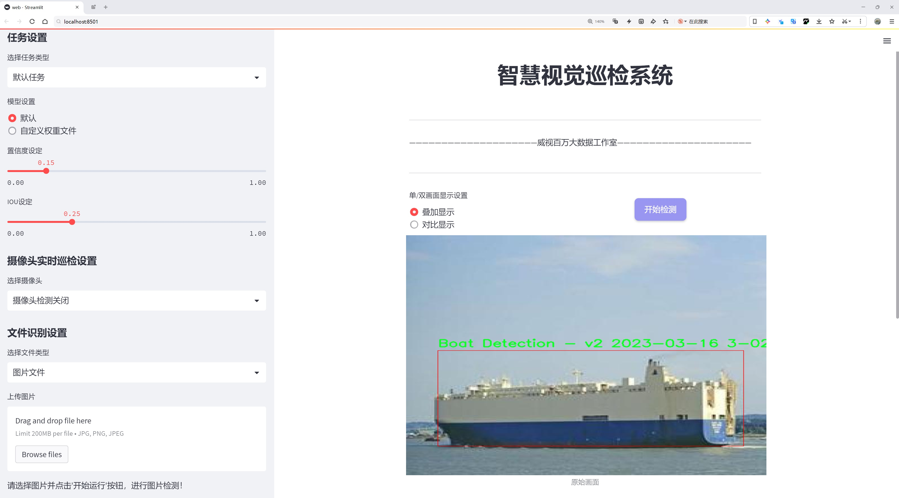
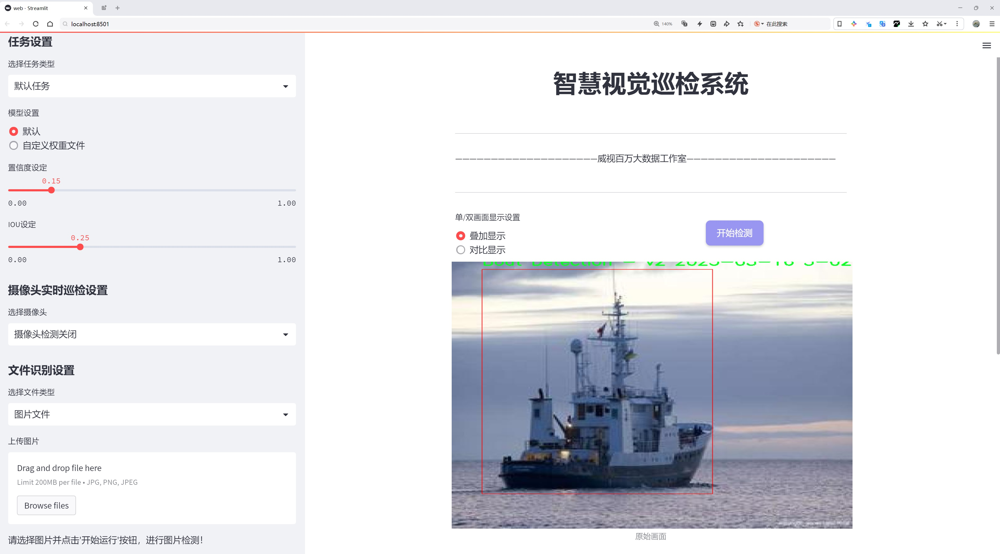
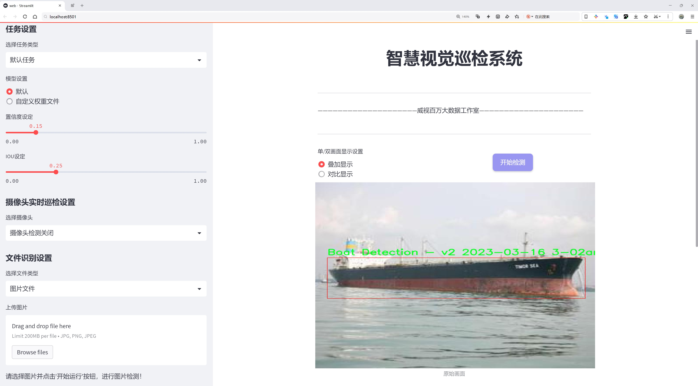
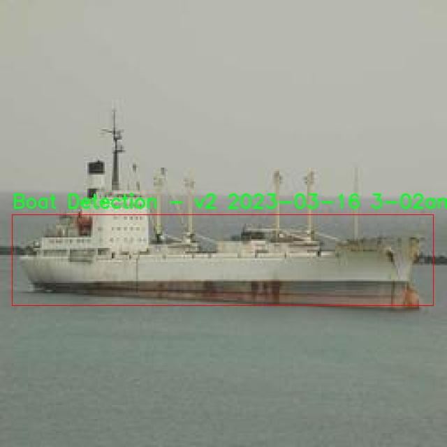
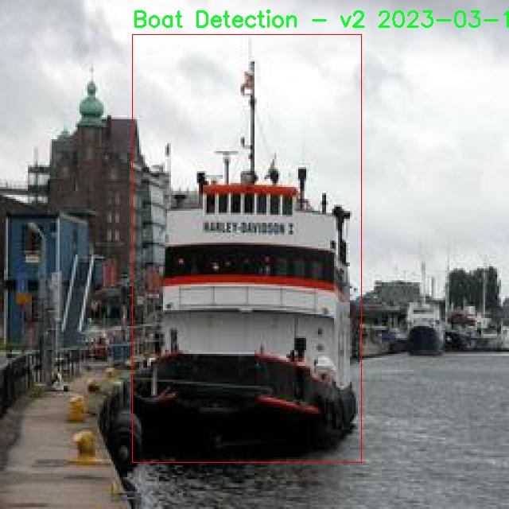
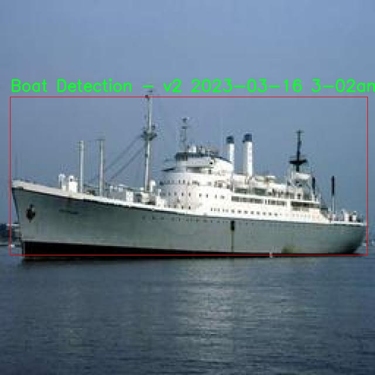
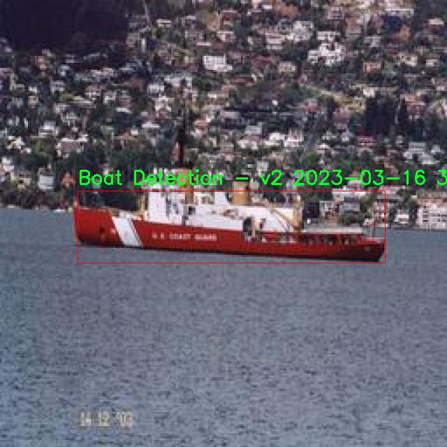
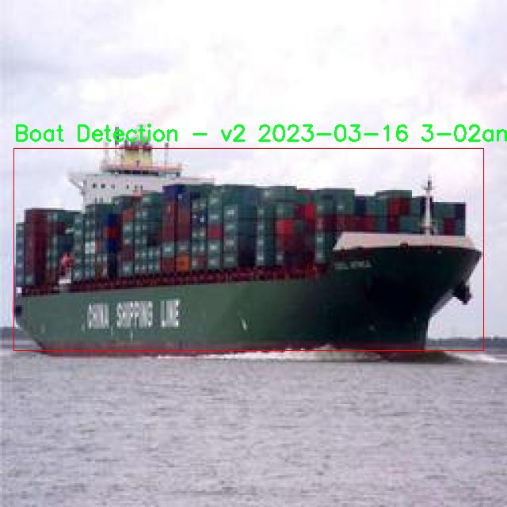

# 船只与角色检测检测系统源码分享
 # [一条龙教学YOLOV8标注好的数据集一键训练_70+全套改进创新点发刊_Web前端展示]

### 1.研究背景与意义

项目参考[AAAI Association for the Advancement of Artificial Intelligence](https://gitee.com/qunshansj/projects)

项目来源[AACV Association for the Advancement of Computer Vision](https://gitee.com/qunmasj/projects)

研究背景与意义

随着全球经济的快速发展，海洋运输业的蓬勃兴起使得船只的管理与监控变得愈发重要。船只在海洋中的活动不仅关系到航运效率，还涉及到海洋安全、环境保护以及海洋资源的合理利用。因此，如何高效、准确地识别和监测船只及其周围的角色（如船员、乘客等）成为了一个亟待解决的技术难题。近年来，深度学习技术的迅猛发展为目标检测领域带来了新的机遇，尤其是YOLO（You Only Look Once）系列模型因其高效性和实时性被广泛应用于各类目标检测任务中。

在众多YOLO模型中，YOLOv8作为最新的版本，进一步提升了检测精度和速度，成为了目标检测领域的研究热点。然而，现有的YOLOv8模型在特定场景下的应用仍存在一定的局限性，尤其是在复杂的海洋环境中，船只与角色的检测精度和鲁棒性亟待提高。因此，基于改进YOLOv8的船只与角色检测系统的研究具有重要的现实意义和应用价值。

本研究将利用“合并的Roblox与船只”数据集，该数据集包含2300幅图像，涵盖了船只检测和角色识别两个主要类别。这一数据集的构建不仅为模型的训练提供了丰富的样本，还为模型在实际应用中的泛化能力奠定了基础。通过对数据集的深入分析，我们可以更好地理解船只与角色在不同场景下的特征表现，从而为模型的改进提供数据支持。

在技术层面，研究将着重于对YOLOv8模型的改进，结合最新的深度学习算法和技术，如特征金字塔网络（FPN）、注意力机制等，旨在提升模型在复杂背景下的检测能力。同时，通过数据增强技术和迁移学习策略，进一步提高模型的训练效率和准确性。通过对船只和角色的高效检测，不仅可以提升海洋运输的安全性，还能为海洋环境监测、海洋资源管理等领域提供技术支持。

此外，本研究的成果将为相关领域的研究者提供有价值的参考，推动船只与角色检测技术的发展。随着海洋经济的不断发展，船只与角色检测系统的应用前景广阔，能够在海洋监控、智能港口、无人驾驶船舶等多个领域发挥重要作用。因此，基于改进YOLOv8的船只与角色检测系统的研究不仅具有学术价值，更具备广泛的社会和经济意义。通过本研究，我们期望能够为海洋安全、环境保护和资源管理贡献一份力量，为推动海洋经济的可持续发展提供技术保障。

### 2.图片演示







##### 注意：由于此博客编辑较早，上面“2.图片演示”和“3.视频演示”展示的系统图片或者视频可能为老版本，新版本在老版本的基础上升级如下：（实际效果以升级的新版本为准）

  （1）适配了YOLOV8的“目标检测”模型和“实例分割”模型，通过加载相应的权重（.pt）文件即可自适应加载模型。

  （2）支持“图片识别”、“视频识别”、“摄像头实时识别”三种识别模式。

  （3）支持“图片识别”、“视频识别”、“摄像头实时识别”三种识别结果保存导出，解决手动导出（容易卡顿出现爆内存）存在的问题，识别完自动保存结果并导出到tempDir中。

  （4）支持Web前端系统中的标题、背景图等自定义修改，后面提供修改教程。

  另外本项目提供训练的数据集和训练教程,暂不提供权重文件（best.pt）,需要您按照教程进行训练后实现图片演示和Web前端界面演示的效果。

### 3.视频演示

[3.1 视频演示](https://www.bilibili.com/video/BV1totoeuE96/)

### 4.数据集信息展示

##### 4.1 本项目数据集详细数据（类别数＆类别名）

nc: 2
names: ['Boat Detection - v2 2023-03-16 3-02am', 'avatar recognition - v2 release']


##### 4.2 本项目数据集信息介绍

数据集信息展示

在现代计算机视觉领域，尤其是在目标检测任务中，数据集的质量和多样性直接影响到模型的性能和泛化能力。本研究所使用的数据集名为“Merged Roblox and Ship”，其主要目的是为了改进YOLOv8模型在船只与角色检测系统中的表现。该数据集的构建旨在融合不同场景下的目标特征，特别是针对船只和虚拟角色的检测，具有重要的研究价值和应用潜力。

“Merged Roblox and Ship”数据集包含两大类目标，分别为“Boat Detection - v2 2023-03-16 3-02am”和“avatar recognition - v2 release”。这两类目标的选择反映了我们在目标检测中所关注的两个重要领域：水上交通工具和虚拟环境中的角色。船只检测不仅涵盖了各种类型的船只，如货船、游艇和渔船等，还考虑了不同天气和光照条件下的场景变化，以提高模型在实际应用中的鲁棒性。而角色识别则聚焦于虚拟世界中的人物形象，尤其是在Roblox等平台上创建的多样化角色，这些角色的外观、服装和动作各异，极大地丰富了数据集的多样性。

数据集的构建过程涉及了大量的图像采集和标注工作。首先，研究团队从多个来源收集了包含船只和角色的图像，包括实地拍摄的水域场景和虚拟游戏环境中的截图。每一张图像都经过精细的标注，确保每个目标的边界框和类别信息准确无误。这种高质量的标注不仅为YOLOv8模型的训练提供了坚实的基础，也为后续的模型评估和优化提供了可靠的数据支持。

在数据集的设计中，我们特别考虑了数据的平衡性和多样性。为了避免模型在某一类别上的过拟合，数据集中船只和角色的样本数量经过精心调整，确保两类目标在训练过程中均衡地被学习。此外，数据集还包含了不同角度、距离和背景下的图像，以模拟真实世界中的复杂场景。这种多样性不仅提高了模型的泛化能力，也使得模型在不同应用场景下的表现更加稳定。

为了进一步提升模型的性能，我们还计划在数据集上应用数据增强技术。这些技术包括随机裁剪、旋转、颜色变换等，旨在生成更多样化的训练样本，帮助模型更好地适应不同的环境和条件。通过这种方式，我们希望能够显著提高YOLOv8在船只与角色检测任务中的准确性和效率。

总之，“Merged Roblox and Ship”数据集的构建不仅为YOLOv8模型的训练提供了丰富的样本，也为船只与角色检测领域的研究提供了新的视角和思路。随着数据集的不断完善和模型的优化，我们期待在未来的研究中能够取得更为显著的成果，为相关领域的发展贡献力量。











### 5.全套项目环境部署视频教程（零基础手把手教学）

[5.1 环境部署教程链接（零基础手把手教学）](https://www.ixigua.com/7404473917358506534?logTag=c807d0cbc21c0ef59de5)


[5.2 安装Python虚拟环境创建和依赖库安装视频教程链接（零基础手把手教学）](https://www.ixigua.com/7404474678003106304?logTag=1f1041108cd1f708b01a)

### 6.手把手YOLOV8训练视频教程（零基础小白有手就能学会）

[6.1 手把手YOLOV8训练视频教程（零基础小白有手就能学会）](https://www.ixigua.com/7404477157818401292?logTag=d31a2dfd1983c9668658)

### 7.70+种全套YOLOV8创新点代码加载调参视频教程（一键加载写好的改进模型的配置文件）

[7.1 70+种全套YOLOV8创新点代码加载调参视频教程（一键加载写好的改进模型的配置文件）](https://www.ixigua.com/7404478314661806627?logTag=29066f8288e3f4eea3a4)

### 8.70+种全套YOLOV8创新点原理讲解（非科班也可以轻松写刊发刊，V10版本正在科研待更新）

由于篇幅限制，每个创新点的具体原理讲解就不一一展开，具体见下列网址中的创新点对应子项目的技术原理博客网址【Blog】：


[8.1 70+种全套YOLOV8创新点原理讲解链接](https://gitee.com/qunmasj/good)

### 9.系统功能展示（检测对象为举例，实际内容以本项目数据集为准）

图9.1.系统支持检测结果表格显示

  图9.2.系统支持置信度和IOU阈值手动调节

  图9.3.系统支持自定义加载权重文件best.pt(需要你通过步骤5中训练获得)

  图9.4.系统支持摄像头实时识别

  图9.5.系统支持图片识别

  图9.6.系统支持视频识别

  图9.7.系统支持识别结果文件自动保存

  图9.8.系统支持Excel导出检测结果数据


### 10.原始YOLOV8算法原理

原始YOLOv8算法原理

YOLOv8算法作为YOLO系列的最新进展，继续在目标检测领域展现出其卓越的性能和灵活性。与前几代YOLO算法相比，YOLOv8不仅在模型结构上进行了创新，还在损失计算、数据增强等多个方面进行了优化，以适应不同场景的需求。YOLOv8提供了五种不同尺度的模型，包括n、s、m、l和x，这些模型在深度、特征图宽度和缩放系数上各有不同，以便在多样化的应用场景中实现最佳性能。

在YOLOv8的网络结构中，整体分为输入端、主干网络和检测端三个主要部分。以YOLOv8n为例，其网络结构设计充分考虑了轻量化和高效性。YOLOv8n模型的主干网络采用了跨级结构（CSP），这一设计理念源于YOLOv5，但经过了进一步的优化，特别是将C3模块替换为更轻量的C2f模块。C2f模块的设计灵感来源于YOLOv7中的ELAN模块，具备更多的残差连接，这使得模型在保持轻量化的同时，能够获取更丰富的梯度信息，从而提升了特征提取的能力。

在特征融合层，YOLOv8依然采用了特征金字塔网络（FPN）和路径聚合网络（PAN）的结合，以便有效地融合来自不同尺度的特征信息。值得注意的是，YOLOv8在特征融合网络中引入了BiFPN网络，这一创新使得模型在处理不同尺度特征时更加高效。BiFPN通过双向跨尺度连接和加权特征融合的方式，优化了特征信息的提取速度，从而提高了目标检测的精度和效率。

YOLOv8在检测头部分采用了当前流行的解耦合头结构，这一结构将分类和检测任务分离，使得模型在处理复杂场景时能够更为灵活。同时，YOLOv8摒弃了传统的Anchor-Based方法，转而采用Anchor-Free的策略，这一变化使得模型在处理不同尺寸目标时表现得更加出色。通过这种方式，YOLOv8能够更好地适应多样化的目标形态，提升了检测的准确性。

在训练过程中，YOLOv8引入了新的数据增强策略，特别是在最后10个epoch中关闭马赛克增强，并采用动态Task-Aligned Assigner样本分配策略。这一策略的实施，使得模型在训练过程中能够更好地适应不同样本的特征，进而提升了模型的泛化能力。

损失计算方面，YOLOv8采用了BCELoss作为分类损失，DFLLoss和CIoULoss作为回归损失。这种损失计算策略的设计，旨在通过更精确的损失函数来提升模型的学习效果，使得YOLOv8在目标检测任务中能够实现更高的准确率。

综上所述，YOLOv8算法通过对主干网络、特征融合、检测头以及损失计算等多个方面的优化，形成了一种高效、准确且灵活的目标检测解决方案。其在设计上充分考虑了轻量化和高效性，使得YOLOv8能够在各种复杂场景中表现出色，成为当前目标检测领域的一项重要技术进展。通过这些创新，YOLOv8不仅延续了YOLO系列的优良传统，还在目标检测的准确性和效率上实现了新的突破，为后续的研究和应用提供了广阔的前景。


### 11.项目核心源码讲解（再也不用担心看不懂代码逻辑）

#### 11.1 code\ultralytics\models\yolo\detect\predict.py

以下是对给定代码的核心部分进行分析和详细注释的结果：

```python
# Ultralytics YOLO 🚀, AGPL-3.0 license

from ultralytics.engine.predictor import BasePredictor  # 导入基础预测器类
from ultralytics.engine.results import Results  # 导入结果类
from ultralytics.utils import ops  # 导入操作工具类

class DetectionPredictor(BasePredictor):
    """
    DetectionPredictor类扩展了BasePredictor类，用于基于检测模型进行预测。

    示例用法：
        ```python
        from ultralytics.utils import ASSETS
        from ultralytics.models.yolo.detect import DetectionPredictor

        args = dict(model='yolov8n.pt', source=ASSETS)  # 设置模型和数据源
        predictor = DetectionPredictor(overrides=args)  # 创建检测预测器实例
        predictor.predict_cli()  # 进行预测
        ```
    """

    def postprocess(self, preds, img, orig_imgs):
        """后处理预测结果，并返回Results对象的列表。"""
        
        # 应用非极大值抑制（NMS）来过滤预测框
        preds = ops.non_max_suppression(
            preds,  # 预测框
            self.args.conf,  # 置信度阈值
            self.args.iou,  # IOU阈值
            agnostic=self.args.agnostic_nms,  # 是否类别无关的NMS
            max_det=self.args.max_det,  # 最大检测框数量
            classes=self.args.classes,  # 过滤的类别
        )

        # 如果输入图像不是列表，转换为numpy数组
        if not isinstance(orig_imgs, list):  # 输入图像是torch.Tensor而不是列表
            orig_imgs = ops.convert_torch2numpy_batch(orig_imgs)  # 转换为numpy批量数组

        results = []  # 初始化结果列表
        for i, pred in enumerate(preds):  # 遍历每个预测框
            orig_img = orig_imgs[i]  # 获取原始图像
            # 将预测框的坐标缩放到原始图像的尺寸
            pred[:, :4] = ops.scale_boxes(img.shape[2:], pred[:, :4], orig_img.shape)
            img_path = self.batch[0][i]  # 获取图像路径
            # 创建Results对象并添加到结果列表
            results.append(Results(orig_img, path=img_path, names=self.model.names, boxes=pred))
        
        return results  # 返回处理后的结果列表
```

### 代码分析
1. **类定义**：`DetectionPredictor` 继承自 `BasePredictor`，用于实现目标检测的预测功能。
2. **postprocess 方法**：这是该类的核心方法，负责对模型的预测结果进行后处理，包括：
   - 应用非极大值抑制（NMS）来去除冗余的预测框。
   - 将输入的图像从 PyTorch 张量转换为 NumPy 数组（如果需要）。
   - 将预测框的坐标缩放到原始图像的尺寸。
   - 创建并返回包含预测结果的 `Results` 对象列表。

### 重要功能
- **非极大值抑制**：通过 `ops.non_max_suppression` 函数来减少重叠的检测框，提高检测精度。
- **坐标缩放**：确保预测框的坐标与原始图像的尺寸相匹配，以便于后续的可视化或分析。
- **结果封装**：使用 `Results` 类来封装每个预测的结果，便于后续处理和展示。

这个文件是Ultralytics YOLO（You Only Look Once）模型的一个预测模块，主要用于基于检测模型进行目标检测的预测。它继承自`BasePredictor`类，提供了一些特定于检测任务的功能。

在这个模块中，首先导入了必要的类和函数，包括`BasePredictor`、`Results`和一些操作工具`ops`。`DetectionPredictor`类的主要功能是处理模型的预测结果，并将其转换为易于使用的格式。

类的文档字符串中给出了一个使用示例，展示了如何创建一个`DetectionPredictor`实例并调用其预测功能。示例中使用了一个YOLO模型（`yolov8n.pt`）和数据源（`ASSETS`），然后通过`predict_cli()`方法进行预测。

`postprocess`方法是这个类的核心功能之一。它接收模型的预测结果`preds`、输入图像`img`和原始图像`orig_imgs`作为参数。首先，使用非极大值抑制（Non-Maximum Suppression, NMS）对预测结果进行后处理，以去除冗余的框并保留最有可能的检测结果。NMS的参数包括置信度阈值、IOU阈值、是否使用类别无关的NMS、最大检测数量和需要检测的类别。

接下来，方法检查输入的原始图像是否为列表。如果不是，说明输入的是一个PyTorch张量，此时需要将其转换为NumPy数组以便后续处理。然后，方法遍历每个预测结果，调整预测框的坐标以适应原始图像的尺寸，并将每个结果封装为`Results`对象。`Results`对象包含了原始图像、图像路径、模型名称和预测框信息。

最后，`postprocess`方法返回一个包含所有结果的列表，便于后续的分析和可视化。这个模块的设计使得目标检测的预测过程变得更加高效和易于管理。

#### 11.2 code\ultralytics\trackers\__init__.py

以下是代码中最核心的部分，并附上详细的中文注释：

```python
# 导入所需的跟踪器类
from .bot_sort import BOTSORT  # 从bot_sort模块导入BOTSORT类
from .byte_tracker import BYTETracker  # 从byte_tracker模块导入BYTETracker类
from .track import register_tracker  # 从track模块导入register_tracker函数

# 定义可供外部导入的模块成员
__all__ = "register_tracker", "BOTSORT", "BYTETracker"  # 允许简化导入，指定可以被外部访问的类和函数
```

### 注释说明：
1. **导入模块**：代码的前两行从不同的模块中导入了两个跟踪器类（`BOTSORT` 和 `BYTETracker`）以及一个注册函数（`register_tracker`）。这些类和函数可能用于目标跟踪的实现。
  
2. **`__all__` 变量**：该变量用于定义模块的公共接口，指定哪些类和函数可以被外部导入。这有助于控制模块的可见性，避免外部访问不必要的内部实现。

这个程序文件是一个Python模块的初始化文件，位于`code/ultralytics/trackers/`目录下。文件的第一行是一个注释，表明该代码与Ultralytics YOLO（一个流行的目标检测框架）相关，并且使用AGPL-3.0许可证。这意味着该代码可以自由使用和修改，但任何基于此代码的衍生作品也必须遵循相同的许可证条款。

接下来的几行代码导入了三个组件：`BOTSORT`、`BYTETracker`和`register_tracker`。这些组件分别来自同一目录下的不同模块。`BOTSORT`和`BYTETracker`可能是实现不同目标跟踪算法的类或函数，而`register_tracker`则可能是一个用于注册跟踪器的函数。

最后一行代码定义了`__all__`变量，这是一个特殊的变量，用于控制从模块中导入的内容。当使用`from module import *`语句时，只有在`__all__`中列出的名称会被导入。这使得模块的使用更加简洁，用户可以通过简单的导入语句来访问所需的功能，而不必关心模块内部的实现细节。

总的来说，这个初始化文件的主要功能是组织和简化模块的导入，使得用户能够方便地使用目标跟踪相关的功能。

#### 11.3 ui.py

```python
import sys
import subprocess

def run_script(script_path):
    """
    使用当前 Python 环境运行指定的脚本。

    Args:
        script_path (str): 要运行的脚本路径

    Returns:
        None
    """
    # 获取当前 Python 解释器的路径
    python_path = sys.executable

    # 构建运行命令，使用 streamlit 运行指定的脚本
    command = f'"{python_path}" -m streamlit run "{script_path}"'

    # 执行命令，并等待其完成
    result = subprocess.run(command, shell=True)
    
    # 检查命令执行的返回码，如果不为0则表示出错
    if result.returncode != 0:
        print("脚本运行出错。")


# 主程序入口
if __name__ == "__main__":
    # 指定要运行的脚本路径
    script_path = "web.py"  # 这里可以替换为实际的脚本路径

    # 调用函数运行脚本
    run_script(script_path)
```

### 代码注释说明：
1. **导入模块**：
   - `sys`：用于访问与 Python 解释器紧密相关的变量和函数。
   - `subprocess`：用于生成新进程、连接到它们的输入/输出/错误管道，并获得它们的返回码。

2. **`run_script` 函数**：
   - 功能：使用当前 Python 环境运行指定的脚本。
   - 参数：`script_path`，表示要运行的脚本的路径。
   - 过程：
     - 获取当前 Python 解释器的路径，以确保使用正确的 Python 环境。
     - 构建一个命令字符串，该命令将使用 `streamlit` 模块运行指定的脚本。
     - 使用 `subprocess.run` 执行构建的命令，并等待其完成。
     - 检查命令的返回码，如果返回码不为0，表示脚本运行过程中出现错误，打印错误信息。

3. **主程序入口**：
   - 使用 `if __name__ == "__main__":` 确保该部分代码仅在直接运行脚本时执行，而不是作为模块导入时执行。
   - 指定要运行的脚本路径（在此示例中为 `web.py`）。
   - 调用 `run_script` 函数，传入脚本路径以执行该脚本。

这个程序文件的主要功能是通过当前的 Python 环境来运行一个指定的脚本，具体来说是一个名为 `web.py` 的脚本。程序首先导入了必要的模块，包括 `sys`、`os` 和 `subprocess`，这些模块提供了与系统交互的功能。`abs_path` 函数则是从 `QtFusion.path` 模块中导入的，用于获取文件的绝对路径。

在 `run_script` 函数中，首先获取当前 Python 解释器的路径，这样可以确保使用正确的 Python 环境来运行脚本。接着，构建一个命令字符串，这个命令会调用 `streamlit` 模块来运行指定的脚本。`streamlit` 是一个用于构建数据应用的流行库。

使用 `subprocess.run` 方法来执行构建好的命令，`shell=True` 参数允许在 shell 中执行命令。执行后，程序会检查返回的状态码，如果返回码不为零，表示脚本运行出错，此时会打印出错误信息。

在文件的最后部分，使用 `if __name__ == "__main__":` 语句来确保只有在直接运行该文件时才会执行后面的代码。这里指定了要运行的脚本路径 `web.py`，并调用 `run_script` 函数来执行这个脚本。

总体来说，这个程序是一个简单的脚本执行器，能够在当前 Python 环境中运行指定的 Streamlit 应用脚本。

#### 11.4 70+种YOLOv8算法改进源码大全和调试加载训练教程（非必要）\ultralytics\utils\metrics.py

以下是代码中最核心的部分，并附上详细的中文注释：

```python
import numpy as np
import torch

def box_iou(box1, box2, eps=1e-7):
    """
    计算两个边界框的交并比（IoU）。输入的边界框格式为 (x1, y1, x2, y2)。

    参数:
        box1 (torch.Tensor): 形状为 (N, 4) 的张量，表示 N 个边界框。
        box2 (torch.Tensor): 形状为 (M, 4) 的张量，表示 M 个边界框。
        eps (float, optional): 避免除以零的小值，默认为 1e-7。

    返回:
        (torch.Tensor): 形状为 (N, M) 的张量，包含 box1 和 box2 中每对边界框的 IoU 值。
    """

    # 获取边界框的坐标
    (a1, a2), (b1, b2) = box1.unsqueeze(1).chunk(2, 2), box2.unsqueeze(0).chunk(2, 2)
    
    # 计算交集面积
    inter = (torch.min(a2, b2) - torch.max(a1, b1)).clamp_(0).prod(2)

    # 计算 IoU = 交集 / (面积1 + 面积2 - 交集)
    return inter / ((a2 - a1).prod(2) + (b2 - b1).prod(2) - inter + eps)

def bbox_iou(box1, box2, xywh=True, eps=1e-7):
    """
    计算 box1 (1, 4) 与 box2 (n, 4) 的交并比（IoU）。

    参数:
        box1 (torch.Tensor): 形状为 (1, 4) 的张量，表示单个边界框。
        box2 (torch.Tensor): 形状为 (n, 4) 的张量，表示 n 个边界框。
        xywh (bool, optional): 如果为 True，输入框为 (x, y, w, h) 格式；如果为 False，输入框为 (x1, y1, x2, y2) 格式。默认为 True。
        eps (float, optional): 避免除以零的小值，默认为 1e-7。

    返回:
        (torch.Tensor): IoU 值。
    """

    # 获取边界框的坐标
    if xywh:  # 从 (x, y, w, h) 转换为 (x1, y1, x2, y2)
        (x1, y1, w1, h1), (x2, y2, w2, h2) = box1.chunk(4, -1), box2.chunk(4, -1)
        b1_x1, b1_x2, b1_y1, b1_y2 = x1 - w1 / 2, x1 + w1 / 2, y1 - h1 / 2, y1 + h1 / 2
        b2_x1, b2_x2, b2_y1, b2_y2 = x2 - w2 / 2, x2 + w2 / 2, y2 - h2 / 2, y2 + h2 / 2
    else:  # 输入框为 (x1, y1, x2, y2)
        b1_x1, b1_y1, b1_x2, b1_y2 = box1.chunk(4, -1)
        b2_x1, b2_y1, b2_x2, b2_y2 = box2.chunk(4, -1)

    # 计算交集面积
    inter = (b1_x2.minimum(b2_x2) - b1_x1.maximum(b2_x1)).clamp_(0) * \
            (b1_y2.minimum(b2_y2) - b1_y1.maximum(b2_y1)).clamp_(0)

    # 计算并集面积
    union = (b1_x2 - b1_x1) * (b1_y2 - b1_y1 + eps) + (b2_x2 - b2_x1) * (b2_y2 - b2_y1 + eps) - inter + eps

    # 返回 IoU 值
    return inter / union

def compute_ap(recall, precision):
    """
    计算给定召回率和精确率曲线的平均精度（AP）。

    参数:
        recall (list): 召回率曲线。
        precision (list): 精确率曲线。

    返回:
        (float): 平均精度。
        (np.ndarray): 精确率包络曲线。
        (np.ndarray): 修改后的召回率曲线，前后添加了哨兵值。
    """

    # 在开头和结尾添加哨兵值
    mrec = np.concatenate(([0.0], recall, [1.0]))
    mpre = np.concatenate(([1.0], precision, [0.0]))

    # 计算精确率包络
    mpre = np.flip(np.maximum.accumulate(np.flip(mpre)))

    # 计算曲线下面积
    x = np.linspace(0, 1, 101)  # 101 点插值（COCO）
    ap = np.trapz(np.interp(x, mrec, mpre), x)  # 积分

    return ap, mpre, mrec
```

### 代码说明：
1. **box_iou**: 计算两个边界框的交并比（IoU），使用 PyTorch 张量处理，支持多组边界框的计算。
2. **bbox_iou**: 计算单个边界框与多个边界框的 IoU，支持两种输入格式（xywh 和 xyxy）。
3. **compute_ap**: 计算平均精度（AP），用于评估目标检测模型的性能，基于召回率和精确率曲线。

这些函数是目标检测模型评估中非常重要的部分，能够帮助我们理解模型在不同情况下的表现。

这个程序文件是YOLOv8算法中的一个模块，主要用于计算模型验证的各种评估指标。文件中包含了多个函数和类，分别用于计算不同的指标，如交并比（IoU）、平均精度（AP）、混淆矩阵等。

首先，文件中定义了一些常量和导入必要的库，包括数学计算、图形绘制和深度学习框架PyTorch等。接着，定义了一些用于计算IoU的函数，如`bbox_ioa`、`box_iou`和`bbox_iou`等。这些函数可以处理不同格式的边界框（bounding box），并计算它们之间的重叠区域，以评估模型的检测性能。

接下来，文件中还定义了`ConfusionMatrix`类，用于计算和更新混淆矩阵。混淆矩阵是一个重要的工具，可以帮助分析模型在分类任务中的表现，包括真正例、假正例和假负例的数量。该类包含多个方法，用于处理分类和检测任务的预测结果，并绘制混淆矩阵的可视化图。

此外，文件中还实现了一些与评估指标相关的函数和类，如`Metric`、`DetMetrics`、`SegmentMetrics`和`PoseMetrics`等。这些类提供了计算精度、召回率、F1分数等指标的方法，并能够处理不同的任务（如检测、分割和姿态估计）。每个类都包含了更新指标、计算平均值和返回结果的功能。

最后，文件中还定义了一些辅助函数，用于绘制精确度-召回率曲线、计算平均精度等。这些函数通过图形化的方式展示模型的性能，便于分析和调优。

总体来说，这个文件为YOLOv8模型提供了全面的评估指标计算和可视化功能，帮助研究人员和开发者更好地理解和改进模型的性能。

#### 11.5 code\ultralytics\utils\callbacks\mlflow.py

以下是代码中最核心的部分，并附上详细的中文注释：

```python
from ultralytics.utils import LOGGER, RUNS_DIR, SETTINGS, TESTS_RUNNING, colorstr

try:
    import os

    # 确保不是在测试环境中运行，且mlflow集成已启用
    assert not TESTS_RUNNING or "test_mlflow" in os.environ.get("PYTEST_CURRENT_TEST", "")
    assert SETTINGS["mlflow"] is True  # 验证mlflow集成是否启用
    import mlflow

    assert hasattr(mlflow, "__version__")  # 验证mlflow包已正确导入
    from pathlib import Path

    PREFIX = colorstr("MLflow: ")  # 设置日志前缀
    # 清理日志参数的函数，将元组中的键值对转换为浮点数
    SANITIZE = lambda x: {k.replace("(", "").replace(")", ""): float(v) for k, v in x.items()}

except (ImportError, AssertionError):
    mlflow = None  # 如果导入失败或断言失败，则mlflow为None


def on_pretrain_routine_end(trainer):
    """
    在预训练例程结束时，将训练参数记录到MLflow。

    此函数根据环境变量和训练器参数设置MLflow日志。它设置跟踪URI、实验名称和运行名称，
    然后在未激活的情况下启动MLflow运行。最后记录训练器的参数。

    参数:
        trainer (ultralytics.engine.trainer.BaseTrainer): 包含要记录的参数和参数的训练对象。

    全局变量:
        mlflow: 用于记录的mlflow模块。

    环境变量:
        MLFLOW_TRACKING_URI: MLflow跟踪的URI。如果未设置，默认为'runs/mlflow'。
        MLFLOW_EXPERIMENT_NAME: MLflow实验的名称。如果未设置，默认为trainer.args.project。
        MLFLOW_RUN: MLflow运行的名称。如果未设置，默认为trainer.args.name。
    """
    global mlflow

    # 获取跟踪URI，如果未设置则使用默认值
    uri = os.environ.get("MLFLOW_TRACKING_URI") or str(RUNS_DIR / "mlflow")
    LOGGER.debug(f"{PREFIX} tracking uri: {uri}")
    mlflow.set_tracking_uri(uri)

    # 设置实验和运行名称
    experiment_name = os.environ.get("MLFLOW_EXPERIMENT_NAME") or trainer.args.project or "/Shared/YOLOv8"
    run_name = os.environ.get("MLFLOW_RUN") or trainer.args.name
    mlflow.set_experiment(experiment_name)

    mlflow.autolog()  # 自动记录
    try:
        # 开始一个新的MLflow运行
        active_run = mlflow.active_run() or mlflow.start_run(run_name=run_name)
        LOGGER.info(f"{PREFIX}logging run_id({active_run.info.run_id}) to {uri}")
        if Path(uri).is_dir():
            LOGGER.info(f"{PREFIX}view at http://127.0.0.1:5000 with 'mlflow server --backend-store-uri {uri}'")
        LOGGER.info(f"{PREFIX}disable with 'yolo settings mlflow=False'")
        mlflow.log_params(dict(trainer.args))  # 记录训练参数
    except Exception as e:
        LOGGER.warning(f"{PREFIX}WARNING ⚠️ Failed to initialize: {e}\n" f"{PREFIX}WARNING ⚠️ Not tracking this run")


def on_train_end(trainer):
    """在训练结束时记录模型工件。"""
    if mlflow:
        # 记录最佳模型和最后模型的文件
        mlflow.log_artifact(str(trainer.best.parent))  # 记录保存目录
        for f in trainer.save_dir.glob("*"):  # 记录保存目录中的所有文件
            if f.suffix in {".png", ".jpg", ".csv", ".pt", ".yaml"}:
                mlflow.log_artifact(str(f))

        mlflow.end_run()  # 结束当前运行
        LOGGER.info(
            f"{PREFIX}results logged to {mlflow.get_tracking_uri()}\n"
            f"{PREFIX}disable with 'yolo settings mlflow=False'"
        )


# 定义回调函数，如果mlflow可用则注册
callbacks = (
    {
        "on_pretrain_routine_end": on_pretrain_routine_end,
        "on_train_end": on_train_end,
    }
    if mlflow
    else {}
)
```

### 代码说明：
1. **导入模块**：导入必要的模块和工具，包括`mlflow`用于记录实验信息。
2. **环境变量和设置检查**：确保在正确的环境中运行，并检查MLflow集成是否启用。
3. **日志记录功能**：定义了`on_pretrain_routine_end`和`on_train_end`两个函数，分别在预训练结束和训练结束时记录参数和模型工件。
4. **回调函数**：根据MLflow的可用性注册回调函数，以便在训练过程中自动记录信息。

这个程序文件是用于Ultralytics YOLO模型的MLflow日志记录功能。MLflow是一个开源平台，用于管理机器学习实验，包括记录模型的参数、指标和工件等。该模块的主要目的是在YOLO训练过程中自动记录相关信息，以便后续分析和可视化。

文件的开头部分包含了一些文档字符串，描述了如何设置和使用MLflow，包括如何设置项目名称、运行名称、启动本地MLflow服务器以及如何终止正在运行的MLflow实例。这些信息为用户提供了基本的使用指南。

接下来，程序尝试导入必要的库，并进行一些基本的检查。首先，它会检查是否在测试环境中运行，如果是，则不会记录日志。然后，它会确认MLflow集成是否已启用，并确保mlflow模块已正确导入。通过这些检查，程序确保在不适合记录的情况下不会产生错误。

程序定义了几个主要的回调函数，用于在不同的训练阶段记录信息。`on_pretrain_routine_end`函数在预训练结束时被调用，它会设置MLflow的跟踪URI、实验名称和运行名称，并启动一个新的MLflow运行。然后，它会记录训练器的参数。

`on_train_epoch_end`和`on_fit_epoch_end`函数分别在每个训练和拟合的epoch结束时被调用，记录训练指标和学习率等信息。这些函数利用了一个名为`SANITIZE`的lambda函数，确保记录的数据格式正确。

最后，`on_train_end`函数在训练结束时被调用，记录模型的工件，包括最佳模型和其他相关文件。所有记录的文件会被上传到MLflow，以便用户后续查看和分析。

在文件的末尾，定义了一个回调字典，包含了在MLflow可用时需要调用的函数。如果MLflow不可用，则该字典为空，这样可以避免在没有MLflow支持的情况下调用这些函数。

总体来说，这个文件实现了YOLO模型训练过程中的自动化日志记录，方便用户追踪和管理他们的机器学习实验。

#### 11.6 train.py

以下是经过简化并添加详细中文注释的核心代码部分：

```python
import random
import numpy as np
import torch.nn as nn
from ultralytics.data import build_dataloader, build_yolo_dataset
from ultralytics.engine.trainer import BaseTrainer
from ultralytics.models import yolo
from ultralytics.nn.tasks import DetectionModel
from ultralytics.utils import LOGGER, RANK
from ultralytics.utils.torch_utils import de_parallel, torch_distributed_zero_first

class DetectionTrainer(BaseTrainer):
    """
    扩展自 BaseTrainer 类的检测模型训练类。
    """

    def build_dataset(self, img_path, mode="train", batch=None):
        """
        构建 YOLO 数据集。

        参数:
            img_path (str): 包含图像的文件夹路径。
            mode (str): 模式，可以是 'train' 或 'val'，用于自定义不同的增强方法。
            batch (int, optional): 批次大小，仅用于 'rect' 模式。默认为 None。
        """
        gs = max(int(de_parallel(self.model).stride.max() if self.model else 0), 32)  # 获取模型的最大步幅
        return build_yolo_dataset(self.args, img_path, batch, self.data, mode=mode, rect=mode == "val", stride=gs)

    def get_dataloader(self, dataset_path, batch_size=16, rank=0, mode="train"):
        """构建并返回数据加载器。"""
        assert mode in ["train", "val"]  # 确保模式有效
        with torch_distributed_zero_first(rank):  # 仅在 DDP 中初始化数据集 *.cache 一次
            dataset = self.build_dataset(dataset_path, mode, batch_size)  # 构建数据集
        shuffle = mode == "train"  # 训练模式下打乱数据
        workers = self.args.workers if mode == "train" else self.args.workers * 2  # 根据模式设置工作线程数
        return build_dataloader(dataset, batch_size, workers, shuffle, rank)  # 返回数据加载器

    def preprocess_batch(self, batch):
        """对图像批次进行预处理，包括缩放和转换为浮点数。"""
        batch["img"] = batch["img"].to(self.device, non_blocking=True).float() / 255  # 将图像转换为浮点数并归一化
        if self.args.multi_scale:  # 如果启用多尺度
            imgs = batch["img"]
            sz = (
                random.randrange(self.args.imgsz * 0.5, self.args.imgsz * 1.5 + self.stride)
                // self.stride
                * self.stride
            )  # 随机选择图像大小
            sf = sz / max(imgs.shape[2:])  # 计算缩放因子
            if sf != 1:  # 如果需要缩放
                ns = [
                    math.ceil(x * sf / self.stride) * self.stride for x in imgs.shape[2:]
                ]  # 计算新的形状
                imgs = nn.functional.interpolate(imgs, size=ns, mode="bilinear", align_corners=False)  # 进行插值缩放
            batch["img"] = imgs  # 更新批次图像
        return batch

    def get_model(self, cfg=None, weights=None, verbose=True):
        """返回 YOLO 检测模型。"""
        model = DetectionModel(cfg, nc=self.data["nc"], verbose=verbose and RANK == -1)  # 创建检测模型
        if weights:
            model.load(weights)  # 加载权重
        return model

    def plot_training_samples(self, batch, ni):
        """绘制带有注释的训练样本。"""
        plot_images(
            images=batch["img"],
            batch_idx=batch["batch_idx"],
            cls=batch["cls"].squeeze(-1),
            bboxes=batch["bboxes"],
            paths=batch["im_file"],
            fname=self.save_dir / f"train_batch{ni}.jpg",
            on_plot=self.on_plot,
        )

    def plot_metrics(self):
        """从 CSV 文件中绘制指标。"""
        plot_results(file=self.csv, on_plot=self.on_plot)  # 保存结果图
```

### 代码说明：
1. **类 `DetectionTrainer`**：这是一个用于训练检测模型的类，继承自 `BaseTrainer`。
2. **`build_dataset` 方法**：构建 YOLO 数据集，接受图像路径、模式和批次大小作为参数。
3. **`get_dataloader` 方法**：构建并返回数据加载器，确保在分布式训练中只初始化一次数据集。
4. **`preprocess_batch` 方法**：对图像批次进行预处理，包括归一化和可能的缩放。
5. **`get_model` 方法**：返回一个 YOLO 检测模型，并可选择加载预训练权重。
6. **`plot_training_samples` 和 `plot_metrics` 方法**：用于可视化训练样本和训练指标的函数。

这个程序文件 `train.py` 是一个用于训练 YOLO（You Only Look Once）目标检测模型的 Python 脚本，主要是基于 Ultralytics 提供的库。该文件定义了一个名为 `DetectionTrainer` 的类，该类继承自 `BaseTrainer`，用于实现目标检测模型的训练过程。

在 `DetectionTrainer` 类中，首先定义了多个方法来处理数据集的构建、数据加载、批处理预处理、模型属性设置、模型获取、验证器获取、损失项标签化、训练进度字符串生成、训练样本绘图以及绘制训练指标等功能。

`build_dataset` 方法用于构建 YOLO 数据集，接受图像路径、模式（训练或验证）和批量大小作为参数。该方法会根据模型的步幅（stride）计算最大值，并调用 `build_yolo_dataset` 函数来生成数据集。

`get_dataloader` 方法用于构建并返回数据加载器。它会根据传入的模式（训练或验证）来初始化数据集，并设置是否打乱数据的顺序。对于训练模式，数据会被打乱，而在验证模式下则不会。

`preprocess_batch` 方法负责对图像批次进行预处理，包括缩放和转换为浮点数格式。该方法支持多尺度训练，随机选择一个大小并调整图像的尺寸。

`set_model_attributes` 方法用于设置模型的属性，包括类别数量和类别名称等，以确保模型与数据集的兼容性。

`get_model` 方法用于返回一个 YOLO 检测模型，并可选择加载预训练权重。

`get_validator` 方法返回一个用于验证 YOLO 模型的验证器，主要用于评估模型的性能。

`label_loss_items` 方法用于返回带有标签的训练损失项字典，便于后续的损失分析。

`progress_string` 方法返回一个格式化的字符串，显示训练进度，包括当前的 epoch、GPU 内存使用情况、损失值、实例数量和图像大小等信息。

`plot_training_samples` 方法用于绘制训练样本及其标注，帮助可视化训练过程中的数据。

最后，`plot_metrics` 和 `plot_training_labels` 方法分别用于绘制训练过程中的指标和创建带标签的训练图，便于分析模型的训练效果。

整体来看，这个文件提供了一个结构化的框架，用于训练 YOLO 模型，涵盖了从数据处理到模型训练和评估的各个方面，适合需要进行目标检测任务的开发者使用。

### 12.系统整体结构（节选）

### 整体功能和构架概括

Ultralytics YOLOv8 是一个强大的目标检测框架，旨在提供高效、易用的工具来进行目标检测、跟踪和评估。整个项目的架构分为多个模块，每个模块负责特定的功能。以下是对主要模块的概述：

- **模型与检测**：`predict.py` 负责模型的预测过程，包括后处理和结果封装。
- **跟踪器**：`__init__.py` 负责初始化跟踪器模块，提供不同跟踪算法的接口。
- **用户界面**：`ui.py` 用于运行 Streamlit 应用，提供用户交互界面。
- **评估指标**：`metrics.py` 提供了计算模型性能评估指标的功能，如 IoU、AP 等。
- **回调函数**：`mlflow.py` 负责与 MLflow 集成，记录训练过程中的各种信息。
- **训练过程**：`train.py` 是训练模型的核心文件，处理数据加载、模型设置和训练循环。
- **数据探索**：`explorer.py` 提供数据集的可视化和探索功能。
- **对象计数**：`object_counter.py` 实现了对象计数的功能，基于检测结果进行统计。
- **结果处理**：`results.py` 处理模型的输出结果，提供结果的封装和可视化。
- **模型导出**：`exporter.py` 负责将训练好的模型导出为不同格式，便于部署。
- **初始化**：`__init__.py` 负责模块的整体初始化，提供对外接口。
- **Hub 回调**：`hub.py` 提供与模型 Hub 的集成，便于模型的共享和管理。
- **编码器模块**：`tiny_encoder.py` 实现了一个轻量级的编码器，用于特定的模型任务。

### 文件功能整理表

| 文件路径                                                                                         | 功能描述                                           |
|--------------------------------------------------------------------------------------------------|--------------------------------------------------|
| `code\ultralytics\models\yolo\detect\predict.py`                                               | 处理模型预测，后处理预测结果并封装为易用格式。 |
| `code\ultralytics\trackers\__init__.py`                                                         | 初始化跟踪器模块，提供不同跟踪算法的接口。     |
| `ui.py`                                                                                         | 运行 Streamlit 应用，提供用户交互界面。         |
| `70+种YOLOv8算法改进源码大全和调试加载训练教程（非必要）\ultralytics\utils\metrics.py`         | 计算模型性能评估指标，如 IoU、AP 等。           |
| `code\ultralytics\utils\callbacks\mlflow.py`                                                   | 与 MLflow 集成，记录训练过程中的信息。          |
| `train.py`                                                                                      | 训练 YOLO 模型，处理数据加载和训练循环。       |
| `code\ultralytics\data\explorer\explorer.py`                                                  | 提供数据集的可视化和探索功能。                   |
| `70+种YOLOv8算法改进源码大全和调试加载训练教程（非必要）\ultralytics\solutions\object_counter.py` | 实现对象计数功能，基于检测结果进行统计。       |
| `70+种YOLOv8算法改进源码大全和调试加载训练教程（非必要）\ultralytics\engine\results.py`       | 处理模型输出结果，提供结果的封装和可视化。     |
| `70+种YOLOv8算法改进源码大全和调试加载训练教程（非必要）\ultralytics\engine\exporter.py`      | 导出训练好的模型为不同格式，便于部署。         |
| `70+种YOLOv8算法改进源码大全和调试加载训练教程（非必要）\ultralytics\__init__.py`            | 模块的整体初始化，提供对外接口。                 |
| `code\ultralytics\utils\callbacks\hub.py`                                                      | 与模型 Hub 集成，便于模型的共享和管理。         |
| `70+种YOLOv8算法改进源码大全和调试加载训练教程（非必要）\ultralytics\models\sam\modules\tiny_encoder.py` | 实现轻量级编码器，用于特定模型任务。            |

这个表格总结了各个文件的主要功能，便于理解整个项目的结构和各个模块之间的关系。

注意：由于此博客编辑较早，上面“11.项目核心源码讲解（再也不用担心看不懂代码逻辑）”中部分代码可能会优化升级，仅供参考学习，完整“训练源码”、“Web前端界面”和“70+种创新点源码”以“13.完整训练+Web前端界面+70+种创新点源码、数据集获取”的内容为准。

### 13.完整训练+Web前端界面+70+种创新点源码、数据集获取


# [下载链接：https://mbd.pub/o/bread/ZpuXlphp](https://mbd.pub/o/bread/ZpuXlphp)